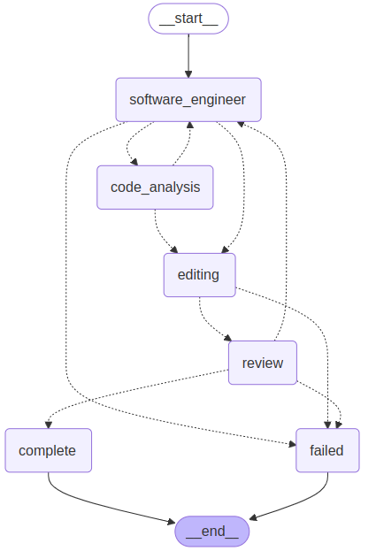

# SWE-Bench Agentic Solver

An LLM-powered agent system using LangGraph and hybrid RAG to solve SWE-Bench tasks.

[](https://github.com/SWE-bench/SWE-bench)

## Features

- Hybrid retrieval combining semantic and lexical search
- State-based workflow management with specialized agents
- Context optimization within token constraints
- Stagnation detection and workflow progression logic
- Official SWE-Bench evaluation harness integration

### Workflow

The graph workflow is implemented in [`graph.py`](src/workflows/graph.py). The workflow visualization:



## Prerequisites

- Python 3.10+
- Git
- OpenAI API key
- SWE-Bench evaluation environment

## Installation

1. **Clone repository**:
   ```bash
   git clone https://github.com/MikhailSadovsky/swe-agent.git
   cd swe-agent

2. **Set up virtual environment**:
   ```bash
    python -m venv venv
    source venv/bin/activate  # Linux/MacOS
    venv\Scripts\activate    # Windows

3. **Install dependencies**:
    ```bash
    pip install -r requirements.txt

4. **Install SWE-Bench harness**:
    ```bash
    git clone https://github.com/SWE-bench/SWE-bench.git
    cd SWE-bench
    pip install -e .
    cd ..

5. **Set OpenAI API key**:
    ```bash
    export OPENAI_API_KEY="your-api-key"  # or configure in .env file

## Usage

Run Agent on SWE-Bench Instances:

    
    python src/main.py --instances astropy__astropy-12907 django__django-10097

Optional arguments:
- dataset - name of the dataset to use for evaluation. Default value is princeton-nlp/SWE-bench_Verified.
- predictions-path - path where predictions are stored. Default value is results/predictions.json.
- llm-model - LLM model to use (currently supported gpt-\*, llama\*). Default value is gpt-4-turbo.
- embeddings-model - model used for embeddings generation. Default value is text-embedding-3-small.

Use this command to see arguments description if needed:

    python src/main.py --help
## Configuration

Modify [`settings.py`](src/config/settings.py) for main parameters

## Evaluation

Results will be generated in:

results/

├── predictions.json      # Generated patches

logs/

├── run_evaluation/      # Detailed test logs
